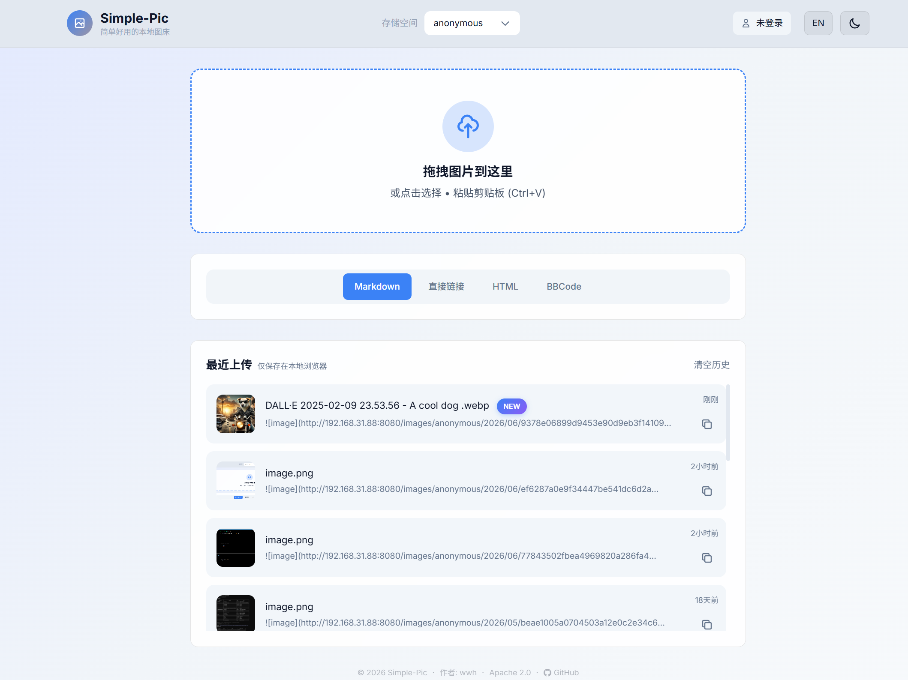
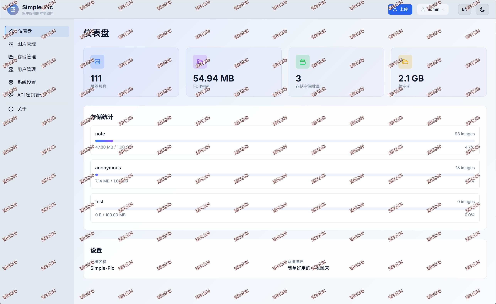
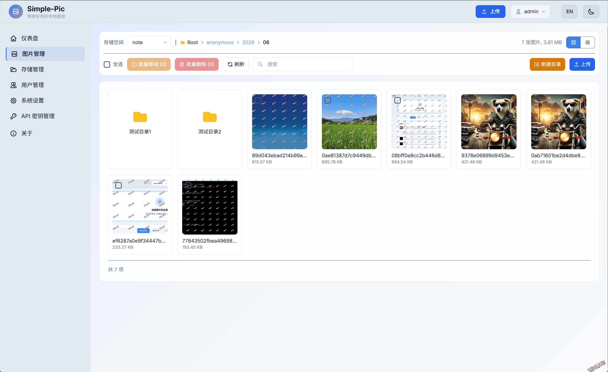
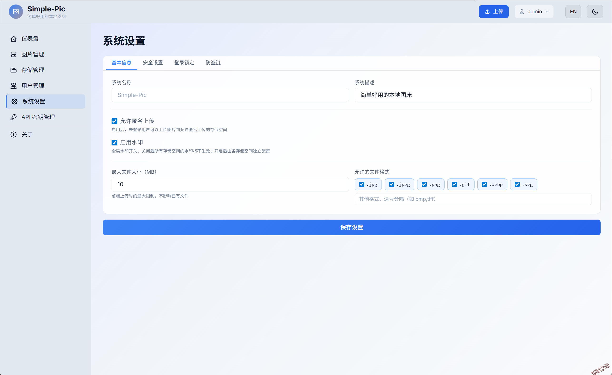

# Simple-Pic

[](LICENSE)
[](https://www.oracle.com/java/)
[](https://spring.io/projects/spring-boot)

Simple-Pic 是一个零数据库的本地图床应用，配置和图片都存储在本地。

它支持图片上传、多用户、多存储空间、后台管理、API 上传、水印、防盗链和访问限流。运行数据保存在本地文件和 `config.yml` 中，不依赖数据库。

## 截图

### 上传页面

支持选择文件、拖拽上传和粘贴上传，上传完成后可直接复制图片链接。



### 仪表盘

集中展示存储空间、图片数量、上传趋势和系统运行状态。



### 图片管理

支持查看、搜索、复制链接和删除图片。



### 系统设置

统一管理上传限制、水印、防盗链、安全策略等配置。



## 功能

- 图片上传：支持选择文件、拖拽、剪贴板粘贴
- 链接复制：支持直链、Markdown、HTML、BBCode
- 后台管理：图片、用户、存储空间、API Key、系统设置
- 水印配置：支持文字水印、位置、透明度、字号、颜色、描边、阴影、平铺、旋转
- 安全控制：登录认证、API Token、防盗链、IP 限流
- 本地配置：无需数据库，配置和运行数据保存在本地

## 快速启动

环境要求：

- JDK 8+

下载发布包后解压，目录内已包含 Windows 和 Linux 启动脚本。

Linux：

```bash
./start.sh
```

Windows：

```bat
start.bat
```

首次启动时，应用程序会：
1. 在项目根目录生成 `config.yml` 配置文件
2. 为管理员账户生成随机密码，并输出到控制台

**示例输出：**
```
==============================================
ADMIN CREDENTIALS:
Username: admin
Password: AbCdEf1234!@#
==============================================
```

使用这些凭据登录：http://localhost:8080/login.html

## API 上传

```bash
curl -X POST http://localhost:8080/api/upload \
  -H "Authorization: Bearer YOUR_API_TOKEN" \
  -F "file=@image.jpg"
```

更多说明见 [API 接口文档](doc/02-API接口文档.md)。

## 配置

主要配置文件为项目根目录下的 `config.yml`。首次启动自动生成，可在后台页面维护用户、存储空间、水印、防盗链、上传限制等设置。

## 文档

- [设计文档](doc/01-设计文档.md)
- [API 接口文档](doc/02-API接口文档.md)
- [用户使用手册](doc/03-用户使用手册.md)

## 许可证

[Apache License 2.0](LICENSE)
